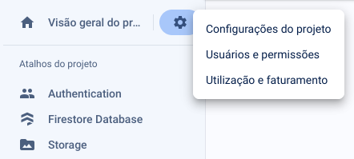
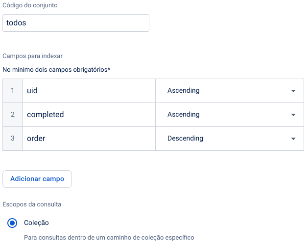
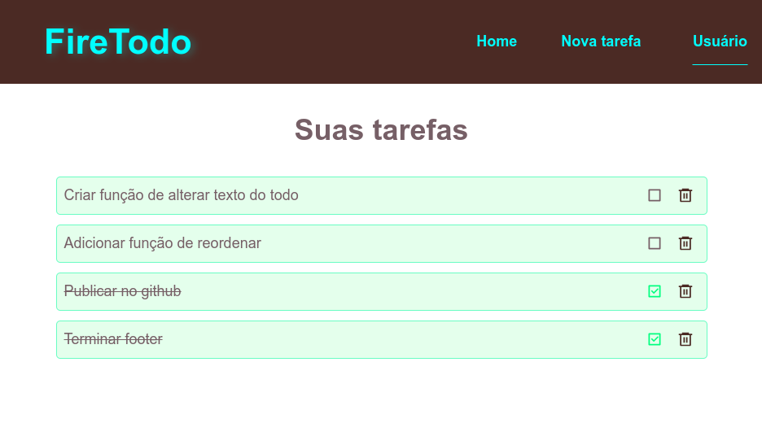
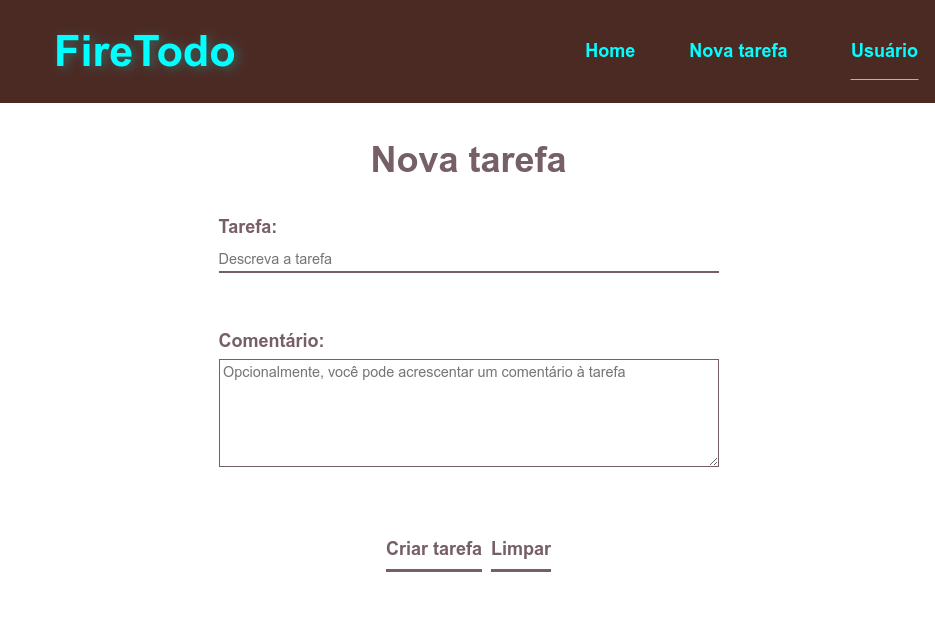
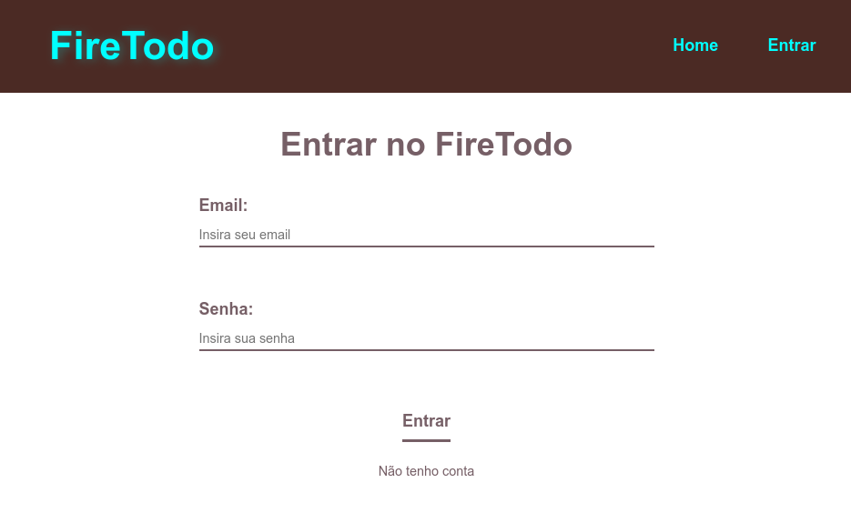

# FireTodo

TodoList feito utilizando **React** e **Firebase** durante a capacitação da [Beets Jr.](https://beetsjr.com.br/) dessas ferramentas.

## Requisitos

1. Possuir o **NodeJS** instalado em sua máquina;

1. Possuir uma conta no [Firebase](https://firebase.google.com/);

1. Criar um projeto no **Firebase** para armazenar suas tarefas usando essa aplicação. Durante sua criação, será exibido a configuração que deve ser usada para acessar o projeto do **Firebase** dentro de algum programa, essa configuração deve ser copiada dentro do aquivo `/src/components/firebase/Config.jsx` da seguinte maneira:

    ```
    export const firebaseConfig = {
        apiKey: ...,
        authDomain: ...,
        projectId: ...,
        storageBucket: ...,
        messagingSenderId: ...,
        appId: ...
    };
    ```

    - O arquivo `Config.jsx` e a pasta `firebase` devem ser criados;
    - Repare que a palavra `export` foi adicionada manualmente;
    - Essas informações podem ser recuperadas pós criação do projeto, pelo Console do Firebase acessando as `Configurações do projeto`:

    

1. Dentro do projeto do **Firebase** deve-se configurar o **Authentication** e o **Firestore**, para ser possível criar usuários, se logar e armazenar dados nesta aplicação;

1. Em **Cloud Firestore** acesse a aba **Índices** e adicione o seguinte índice:

    

## Galeria

### Página inicial quando está logado



### Página para criar uma nova tarefa



### Página de login

